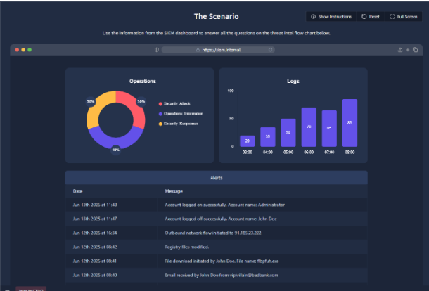
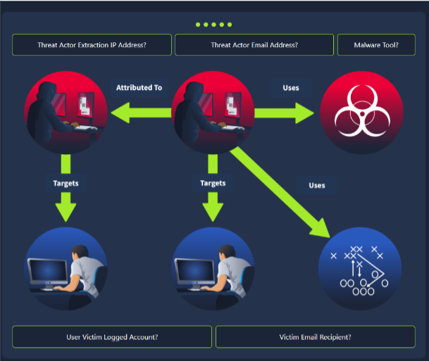

#Threat intelligence – Provides the context that helps an analyst decide which of the two hundred alerts they just received represents genuine danger

#Data – an unprocessed observable

#Information – Data plus factual annotation

#Intelligence – Analyzed information that answers so-what

#Enrichment – Rapid, methodical lookups of public, commercial, and internal sources that shed light on origin, behavior, and relevance

#Indicator of Attack – A malicious action, such as PowerShell launching an unknown service, is underway

#TIP - Maintain a browser bookmark folder or a SIEM launcher panel that opens your preferred look-ups with the highlighted indicator pre-populated. The thirty seconds saved per alert compound into hours over a month

#Feed – A scheduled stream of indicators, usually delivered in various formats such as CSV, JSON, STIX, or through TAXII. Over-ingesting feeds without curation drowns analysts in false positives and erodes trust in the program

#Platform - A structured repository that stores indicators, tracks enrichment, maps relationships, and enforces sharing permissions. MISP and  OpenCTI  are leading open- source examples

#Four broad sources that SOC analysts will come across:
  #Internal telemetry - SIEM logs, EDR detections, phishing-mailbox submissions provide the highest immediate relevance
  #Commercial services - Vendor premium feeds, paid sandboxes**,** and closed- source analytics. These provide high fidelity but may have export and sharing limits based on licensing
  #Open-source intelligence (OSINT) - AbuseIPDB, URLhaus, public blogs with IOCs, and academic research. Before applying, information from these sources will need to be cross-confirmed
  #Communities & ISACs - Sector-specific lists marked with labels and rich context (e.g., FS-ISAC)

#Threat Intelligence Classifications:

  #Strategic intel - High-level intelligence that looks into the organization’s threat landscape and maps out the risk areas based on trends, patterns and emerging threats that may impact business decisions. An example is an annual ransomware 
  #trends report predicting a shift to data-wiping extortion in healthcare
  #Tactical intel - Assessments of adversaries&#39; behaviors through analysis of tactics, techniques, and procedures (TTPs). This can be in the form of Advisory notes, such as detailing new T1059.005 (Visual Basic) abuse in malspam
  #Operational intel - Campaign-specific details about the motives and intent to perform an attack. This is useful for understanding the critical assets available in the organization (people, processes, and technologies) that may be targeted
  #Technical intel - Atomic indicators and artefacts such as IPs and hashes related to an attack

#TLP – A primer for proper sharing

#A four-color labeling scheme defined by FIRST.org that governs how widely intel may be shared

#Structured Threat Information Expression (STIX) – A JSON schema developed to describe and specify threat indicators, relationships, and context in a machine-readable form

#Processing – The phase of the CTI lifecycle where data is converted into usable formats through sorting, organizing, correlation, and presentation

#Direction – The phase of the CTI lifecycle during which security analysts get the chance to define the questions to investigate incidents

#CTI Lifecycle – A six-phase intelligence lifecycle that transforms raw data into contextualized and action-oriented insights geared towards triaging security incidents
  #Planning and Direction
  #Collection
  #Processing
  #Analysis
  #Dissemination
  #Feedback

#The MITRE ATT&amp;CK framework provides labels for each technique that adversaries use, helping to clearly explain to people across different branches of cybersecurity what’s happening

#D3FEND – The defender’s framework. How we respond to incidents

#CVE (Common Vulnerabilities and Exposures) - provides a catalogue number for discovered vulnerabilities, e.g., CVE-2023-4863

#CVSS (Common Vulnerability Scoring System) - a 0–10 severity scale with temporal and environmental modifiers for vulnerabilities

#NVD (National Vulnerability Database) - the canonical repository that links CVE numbers to CVSS scores, exploits, and affected products

#TAXII - The Trusted Automated eXchange of Indicator Information is a set of secure APIs used to exchange threat intelligence in near real-time for detection, prevention, and mitigation of threats
  #Supports two sharing models –
    #Collection – Ensures threat intel is collected and hosted by a producer
    #Channel – Publishes threat intel to users from a central server

#Lab:

#Threat Actor Extraction IP Address – 91.185.23.222
#Threat Actor Email Address – vipivillain@badbank.com
#Malware Tool – flbpfuh.exe
#User Victim Logged Account – Administrator
#Victim Email Recipient – John Doe
#What was the source email address? – vipivillain@badbank.com
#What was the name of the file downloaded? - flbpfuh.exe

