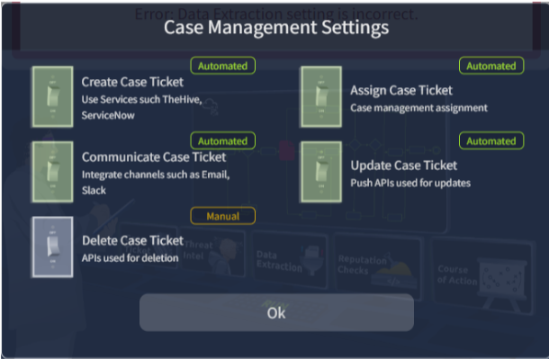
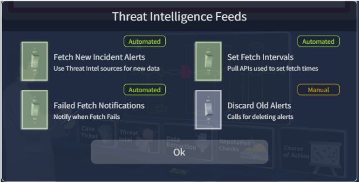
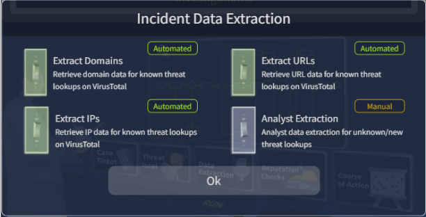
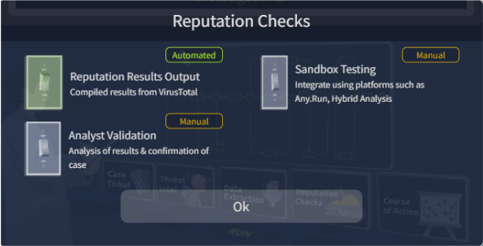
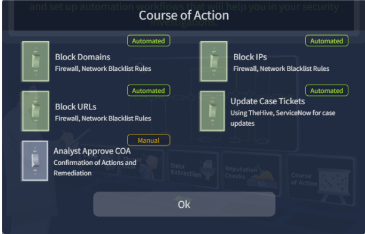

#These notes and lab records are from the TryHackMe room "Introduction to SOAR." The lab focused on automating SOAR tools and distinguishing which tools and processes are best reviewed manually.

#Notes:

#SOAR – Security Orchestration, Automation, and Response
  #Unifies all security tools used in a SOC

#Key SOC capabilities
  #Monitoring and Detection
  #Recovery and Remediation
  #Threat Intelligence
  #Communication

#Key Challenges Faced by SOCs
  #Alert Fatigue
  #Too many disconnected tools
  #Manual Processes
  #Talent Shortage

#Core Strengths of SOAR
  #Orchestration – displays data from SIEM, Threat Intelligence, IAM, and Ticketing tools all at once, reducing the need to hop between multiple tools
  #Automation – Removes the need for SOC Analysts to manually click on different procedures. Instead, playbooks are automated and will be deployed immediately when an issue is identified
  #Response – Responses are automated, and can perform tasks automatically. A significant advantage compared to depending on SOCs to notice the alert and respond to it

#Phishing attacks – The most common attack vector used in breaches

#Common Vulnerabilities and Exposures (CVE) Playbook – A vulnerability that is disclosed publicly and assigned a number based on how serious the vulnerability is
  #Playbook is used to organize response steps when a new CVE is noticed, or the scoring of a CVE changes

#Lab:

#Scenario: You are part of a SOC team that recently faced a large breach investigation that took ages due to a lack of automation. Your friend, McSkidy, recently advised adopting a SOAR and setting up automation workflows (also
#called playbooks) to help your security investigations. McSkidy sent you a checklist for a Threat Intelligence integration workflow, and your task is to figure out how it works. Click the View site button below to launch the site in split view.
#To automate the process, use the different screens to activate the elements required for the SOAR workflow. Run and test the workflow until you get a smooth transition on the flowchart to complete the task.

