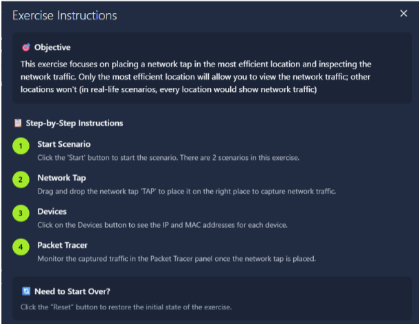
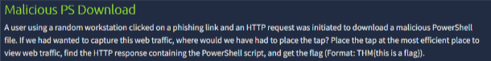
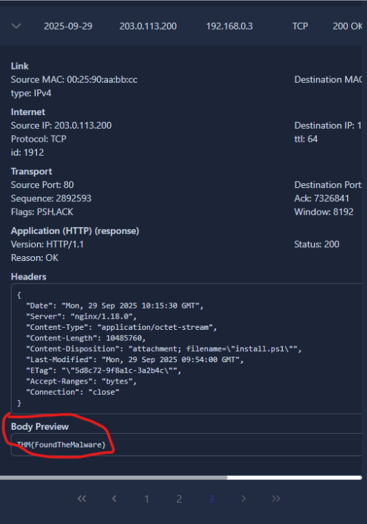
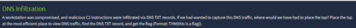
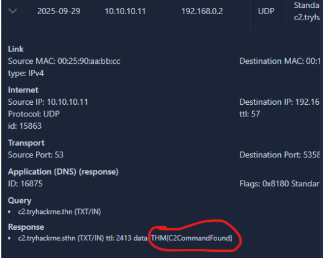

#Network Traffic Analysis (NTA) – A process that encompasses capturing, inspecting, and analyzing data as it flows in a network

#DNS Tunneling – A technique used to smuggle C2 commands via DNS

#Session hijacking can be detected by analyzing the sequence numbers included in the header
  #If the sequence numbers are suddenly far apart, further investigation is warranted

#Fragmentation attack – Uses fragments from legitimate TCP headers to try and sneak into a system when the TCP is larger than the Maximum Transmission Unit (MTU)

#Sequence number – A field in the TCP header that can be used to detect session hijacking
  #If sequence numbers go from 18,19, 20 to 190,987,213, this is a likely session hijacking attempt

#Intermediary Sources – Devices through which traffic mostly passes
  #Think firewalls, switches, web proxies, IDS, IPS, routers, access points, wireless LAN routers, etc.

#Endpoint Sources – Devices where traffic originates and ends. Take the bulk of the network bandwidth
  #Think servers, hosts, IoT devices, printers, lab machines, cloud resources, mobile phones, tablets, etc.

#Kerberos – Needed before an SMB session can be established

#Lab

#TAP 1 – Between WP1 and FW1
  #All devices in the network send their HTTP(S) requests to the Web Proxy. The proxy then initiates the connection to the destination. Placing the tap on this device means capturing all web traffic exiting and entering the network

#Scroll through pages to page 3, then review the “body preview” to see the flag

#TAP 2 – Between SW01 and SRV-DNS
  #SRV-DNS handles all external DNS queries and replies on behalf of the host, which means all external DNS traffic passes through it

#Scroll until you find the Standard Query response with TXT c2.tryhackrne.thn.
  #Remember that the DNS for this website should be tryhackme

