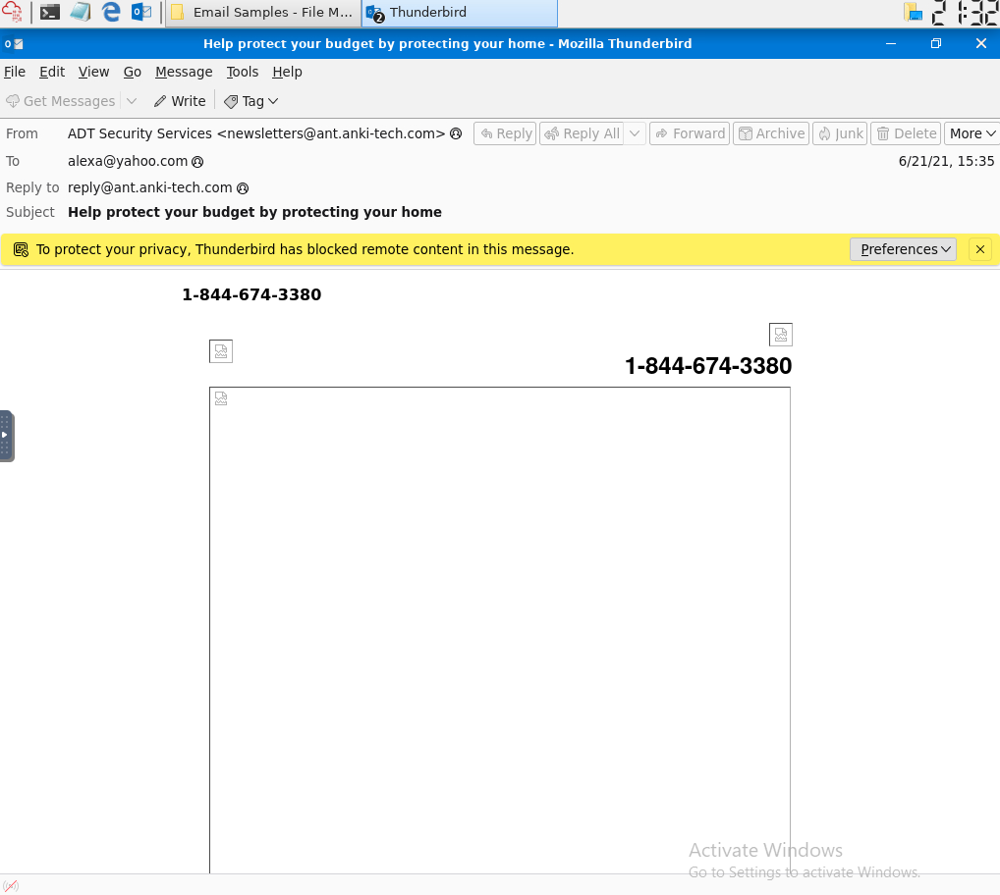
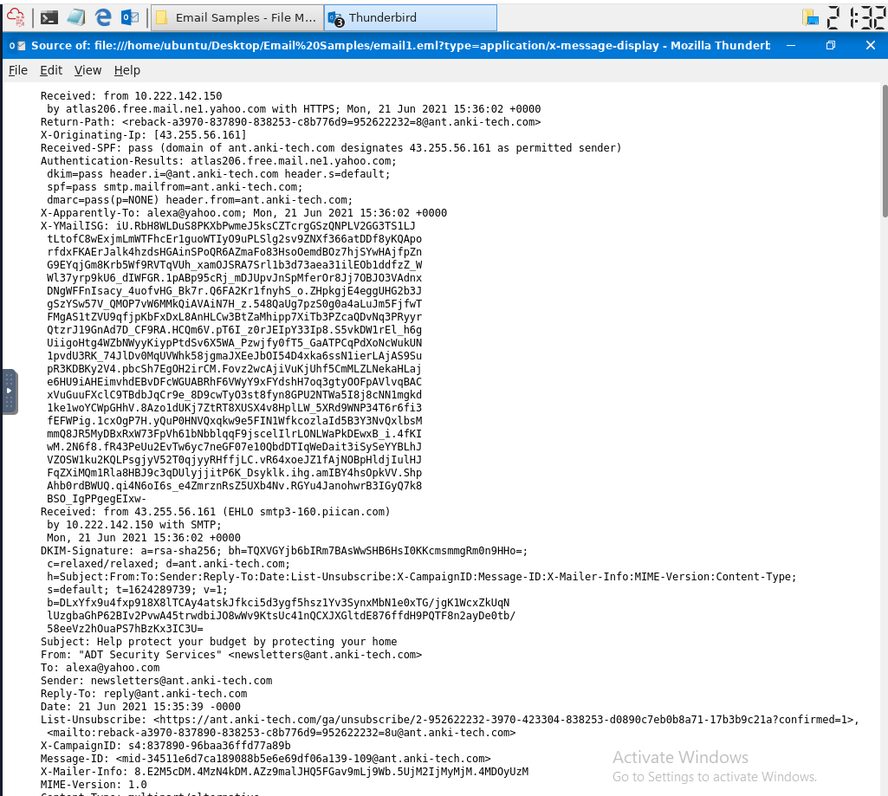
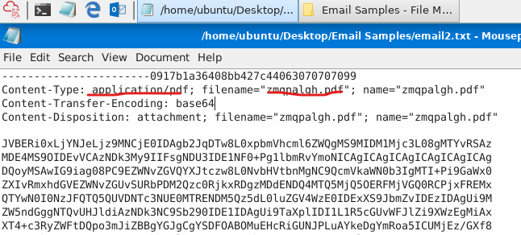
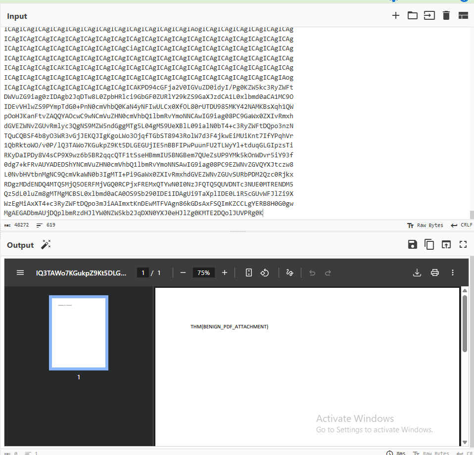
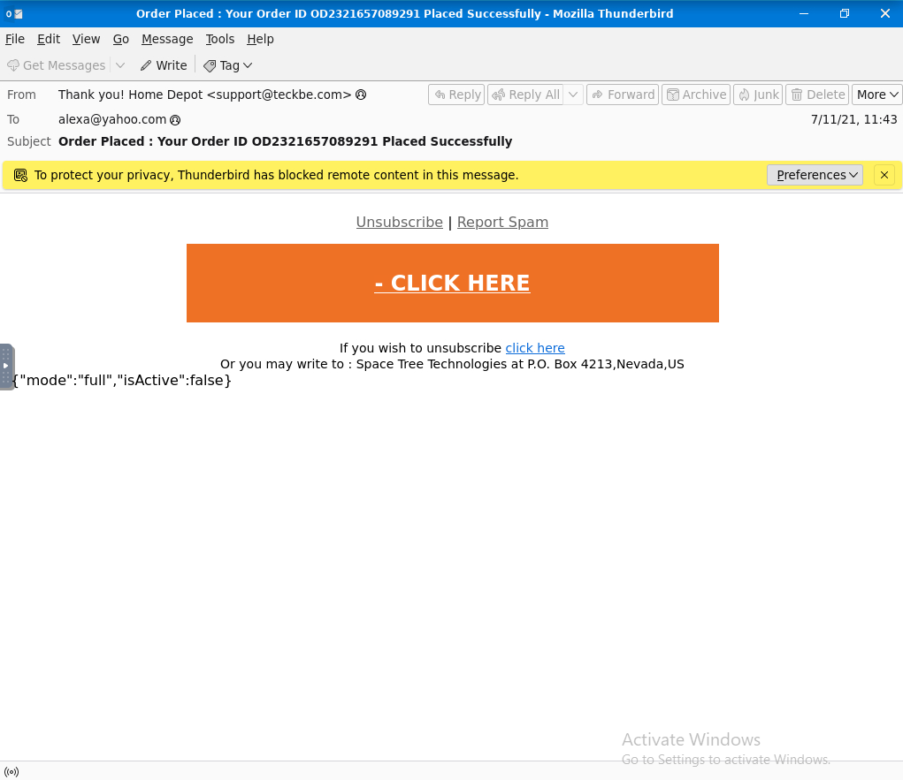
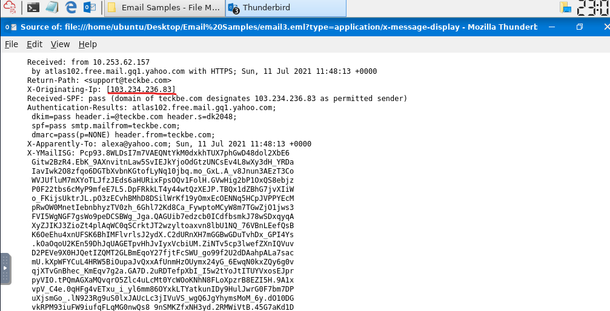
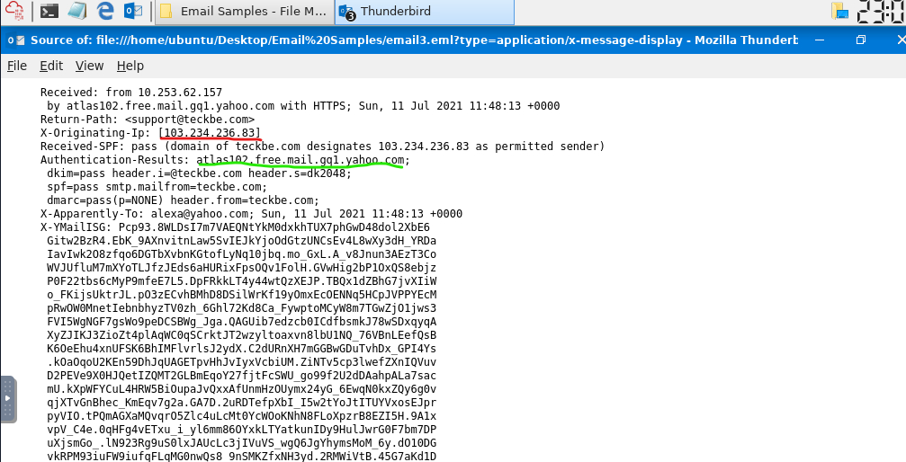

#Notes:

#Spam and Phishing remain the most common social engineering threats facing modern organizations
  #Spam is often low-risk, but phishing can lead to disclousre of sensitive information or unknowingly deploying malware

#Anatomy of an email address: All emails are made of the following components:
  #Username
  #@symbol
  #Domain name

#Question 1: Identify the domain used in the following email address:
  #tryhatme.com

#When you send an email, several protocols work together behind the scenes to deliver your message from sender to recipient:
  #Simple Mail Transfer Protocol (SMTP) - Sends emails
  #Post Office Protocol (POP3) - Downloads emails to a device
  #Internet Message Access Protocol (IMAP) - Syncs emails across devices

#POP3 vs IMAP
  #POP3 Messages - emails are downloaded and stored on a single device, sent messagfes are stored on the single device from which the email was sent
  #IMAP Messages - Emails are stored on the server and can be downloaded to multiple devices, sent messages are stored on the server

#Simplified email train:
  #User sends an email: The sender’s email client sends the message to their mail server using SMTP
  #Mail server queries DNS: The sending server asks DNS for the recipient domain’s mail server
  #DNS responds: DNS returns the address of the recipient’s mail server
  #Email is delivered: The message is sent across the Internet to the recipient’s server
  #The recipient checks their mailbox: The recipient’s email client connects to their mail server
  #Email is retrieved: The message is downloaded (POP3) or synced (IMAP) to the recipient’s device

#Question 2:
  #Which protocol is responsible for sending an email form a client to a mail server?
    #SMTP
  #Which service is used to look up the receipt domain's mail server?
    #DNS
  #Bob wants to access his email from multiple ddevices, including his phone and laptop. Which protocol should he use?
    #IMAP

#Emails consist of two main parts:
  #Header - Contains metadata about the message, such as sender and the servers involved in delivery
  #Email body - Contains the actual message content, which may be plain text or HTML

#Question 3:
  #What is the full subject line email1.eml?
    #Help protect your budget by protecting your home
  #View the message source of email1.eml using Thunderbird in your VM. What is the IP address listed as the X-Originating-Ip?
    #43.255.56.161

#Question 4:
  #What is the Content-Type of the attachment?
    #application/pdf
  #What is the name of the attachment from the previous question?
    #zmqpalgh.pdf

  #Decode the base64 string using either a PDF converter or CyberChef. What is the hidden flag value?
    #THM{BENIGN_PDF_ATTACHMENT}

#There are several primary categories of phishing, and each have their own unique targets:
  #Spam: Unsolicited bulk emails sent to a large number of recipients. A more malicious form of spam is often called malspam
  #Phishing: Emails that impersonate a trusted entity to trick recipients into revealing sensitive information
  #Spear Phishing: A targeted form of phishing aimed at a specific individual or organization, often using personalized information
  #Whaling(opens in new tab): A type of spear phishing that specifically targets high-level executives (CEO, CFO) to obtain sensitive data or financial access
  #Smishing(opens in new tab): Phishing attacks conducted via SMS or text messages, targeting users on mobile devices
  #Vishing(opens in new tab): Phishing attacks carried out through voice calls, where attackers use social engineering over the phone

#All phishing attacks have similar characteristics:
  #Spoofed From Address: The sender’s email is spoofed to appear as a trusted entity (noreply@microsof.com)
  #Urgent Subject or Message: The email creates a sense of urgency (“Your account will be locked in 24 hours”)
  #Brand Impersonation: The email is designed to mimic a legitimate organization (logos or colors matching a real company)
  #Grammar & Spelling Issues: The message may contain errors, though with AI these are now less common (awkward phrasing or unnatural wording)
  #Generic Content: The message lacks personalization (“Dear Customer” instead of your name)
  #Hidden or Shortened Links: Hyperlinks may disguise their true destination (bit.ly/secure-login)
  #Malicious Attachments: Attachments are included and disguised as legitimate files (invoice.pdf.exe)

#Defanging a url is a safe way to investigate it. To defang it, place the ://, and all .'s in brackets []. Also be sure to change the t's in http to x's
  #ex. http://www.suspiciousdomain.com ---> hxxp[://]www[.]suspiciousdomain[.]com

#Question 5:
  #Which reputable organization is being spoofed in this phishing attempt?
    #Home Depot
  #What is the sender's email address?
    #support@teckbe.com

  #What is the defanged X-Originating-IP?
    #103[.]234[.]236[.]83

  #WWhich mail server granted the Authentication-Results header?
    #atlas102.free.mail.gql.yahoo.com

