#Header Artifacts:
  #Sender email address
  #Sender IP address
  #Email subject line
  #Recipient email address
  #Reply-To email address
  #Date and Time

#Body Analysis:
  #URLs and hyperlinks
  #Attachment name(s)
  #Attachment hash

#Messageheader – Part of the Google Admin Toolbox, helps analyze email headers

#Message Header Analyzer – Can perform the same type of analysis that the Messageheader can

#IPinfo – A simple and effective tool for gathering information about an IP address

#URLScan.io – A tool that enables analysts to safely investigate websites without visiting them directly

$Talos IP &amp; Domain Reputation Center – A threat intelligence tool from Cisco that enables analysts to assess the reputation of IP addresses, domains, and networks

#URL extraction tool – Lets you paste raw email content and automatically parse all embedded links, saving time and reducing the risk of missing hidden or obfuscated URLs

#VirusTotal – A widely used tool that allows analysts to check the reputation of files, URLs, IP addresses, and domains using data from dozens of security vendors

#sha256sum – A Linux command that can be used to obtain the hash value of an attachment

#ANY.RUN – An interactive malware sandbox that allows analysts to safely execute and observe suspicious files and URLs in real time

#Hybrid Analysis – A free malware analysis sandox that allows analysts to upload and examine suspicious files in a controlled environment

#JOESandbox – Created for advanced malware analysis. It performs both static and dynamic analysis on suspicious files and URLs

#PhishTool – Automates a majority of manual work involved in analyzing suspicious emails

#Lab

#Scenario: You are a level 1 SOC analyst. As the first line of defense, you have to identify phishing and spam emails reported by end users. In the following tasks, you will step into that role and analyze multiple suspicious emails that have been escalated by coworkers.
#Your objective is to carefully review each email, extract key indicators, and identify any signs of malicious activity. The findings you uncover will help your team develop detection rules to prevent similar threats from reaching other users in the future.

#Question 1:
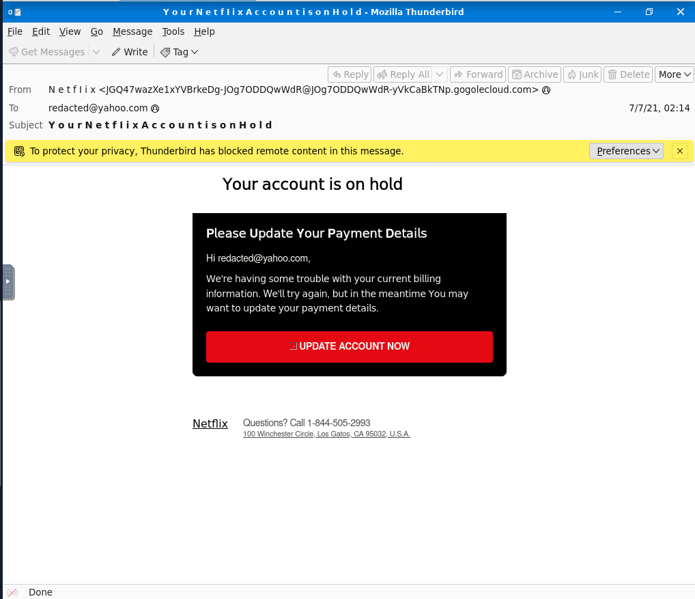
  #What reputable brand is this email tailored to imppersonate?
    #Netflix
  #Based on the email headers, who is the intended recipient of this message?
    #redacted@yahoo.com
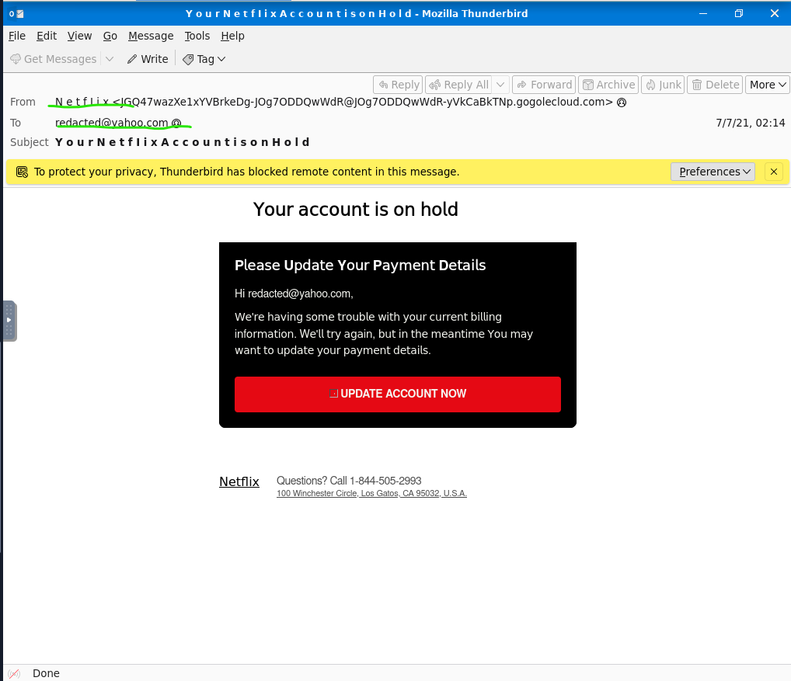
  #In Thunderbird mail use View -> Message Source. What is the Received: from IP address?
    #10.197.37.234
   #Check out the Return-Path field in the message source. What would you consider a domain of interested based on this field?
    #etekno.xyz
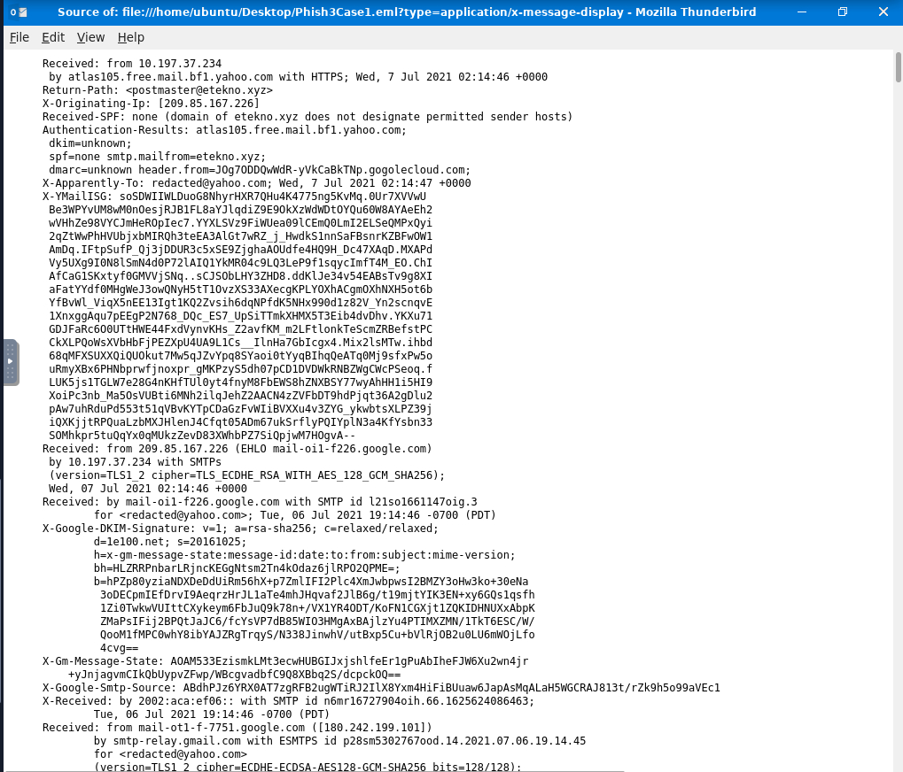
  #Investigate the UPDATE ACCOUNT NOW botton. What is the shortened URL?
    #https://t.co/yuxfZm8KPg?amp=1
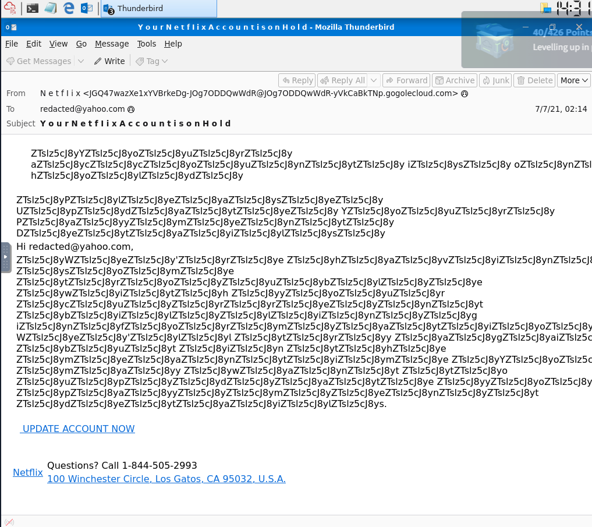

#Question 2:
  #Using the sandbox environment, answer the following questions:
    #How does ANYRUN classify this suspected phishing email?
      #Suspicious Activity
    #What is the name fo the PDF attachment?
      #Payment-updateid.pdf
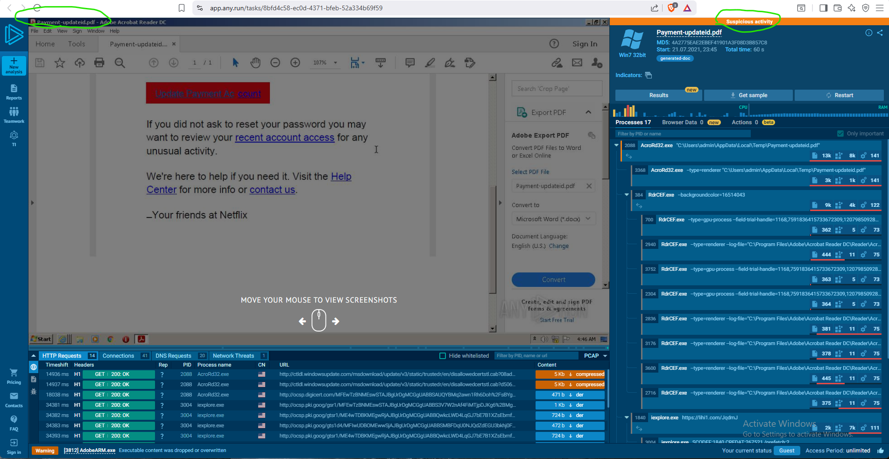
    #What is the SHA256 hash of the PDF file?
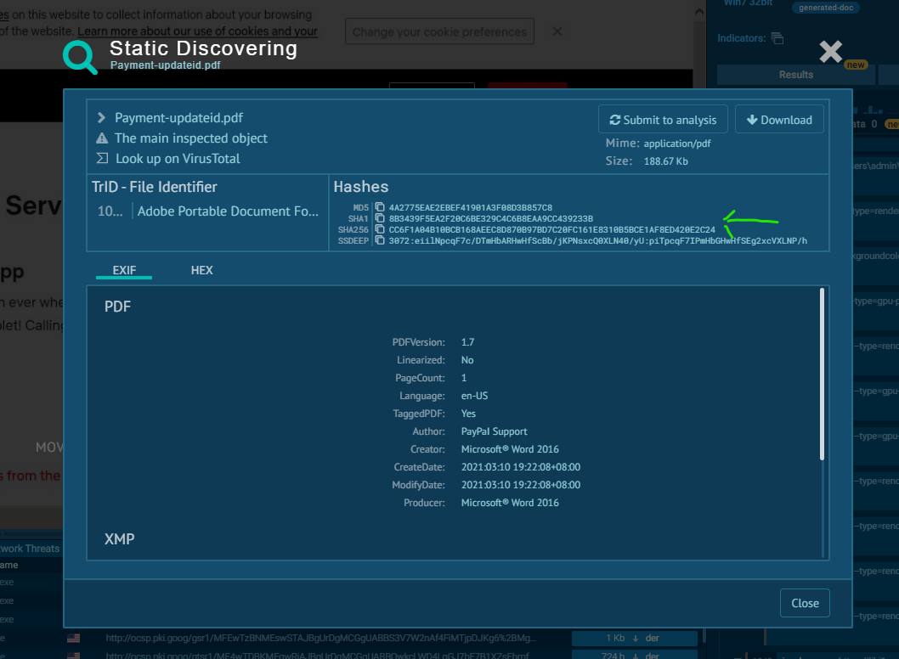
    #Check out the ANYRUN text report on the phishing email. Which IP address associated with the process AcroRd32.exe is flagged as malicious?
      #2.16.107.24
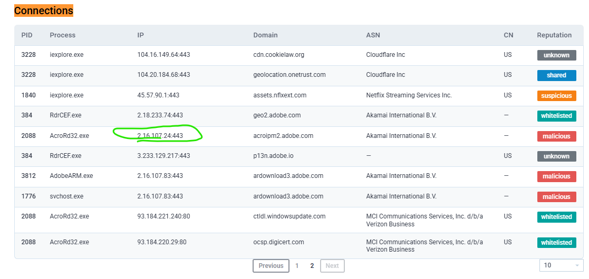
    #Continue investigating the text report. Which Windows process is classed as Potentially Bad Traffic?
      #svchost.exe
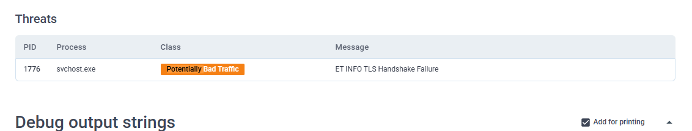

#Question 3:
  #How does ANYRUN classify the .xlsx attachment?
    #Malicious activity
  #What is the file name of the Excel attachment?
    #CBJ200620039539.xlsx

  #What is the SHA256 hash value?
    #5f94a66e0ce78d17afc2dd27fc17b44b3ffc13ac5f42d3ad6a5dcfb36715f3eb
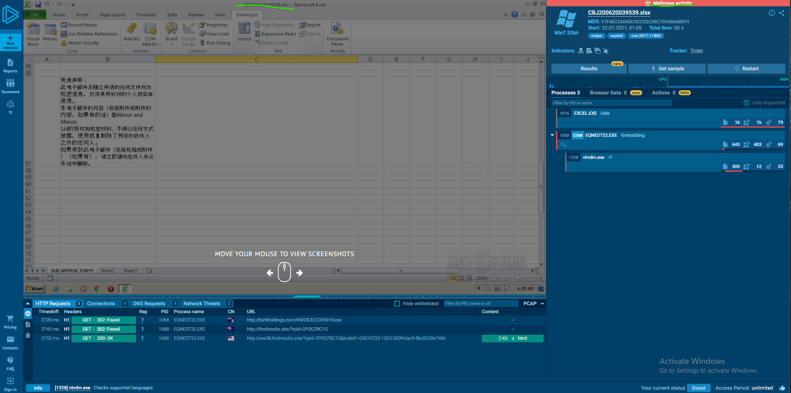
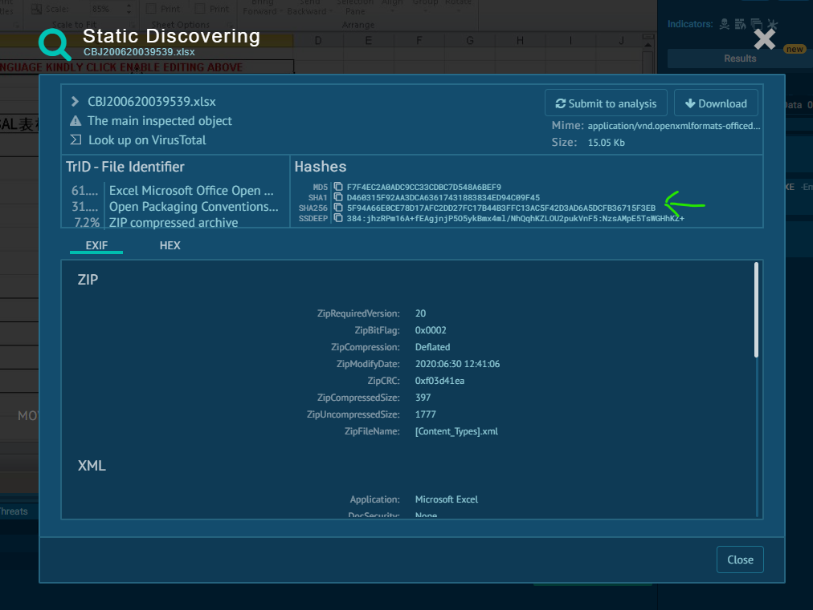
  #What IP Address is associated with the maliciious domain biz9holdings.com?
    #204.11.56.48
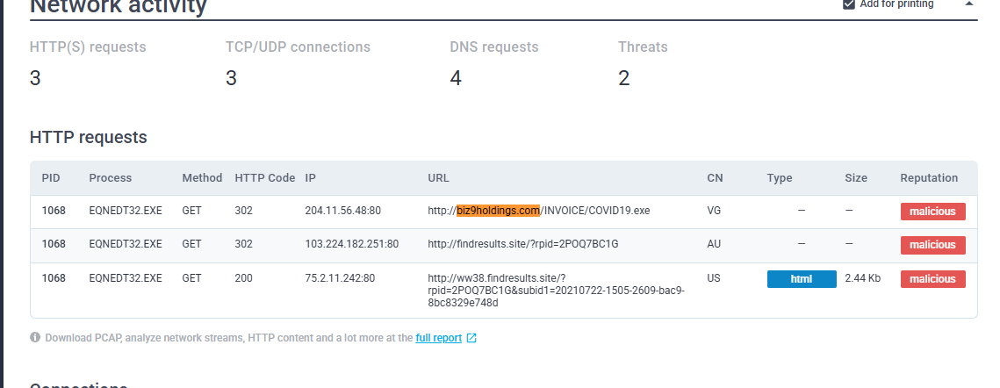
  #Which other domain is classified as malicious?
    #Find results[.]site
  #What vulnerability does this malicious attachment attempt to exploit?
    #CVE-2017-11882
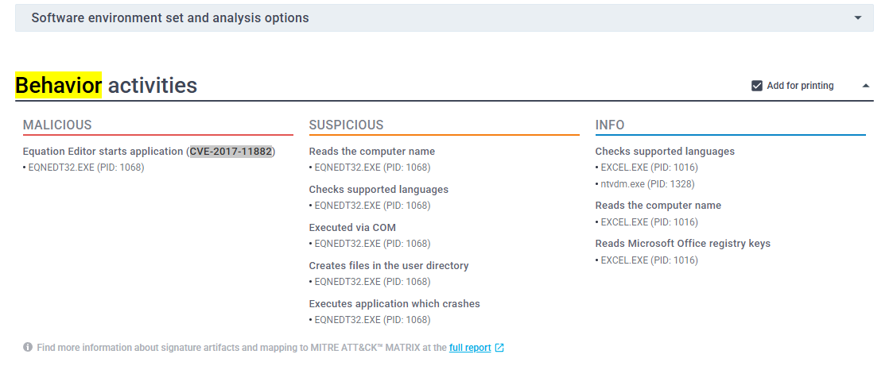
