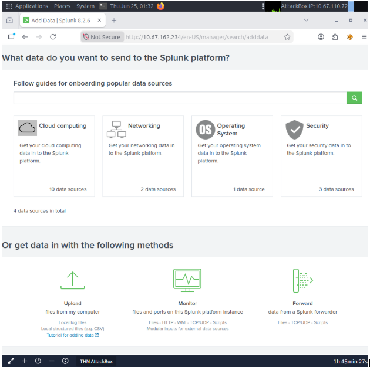
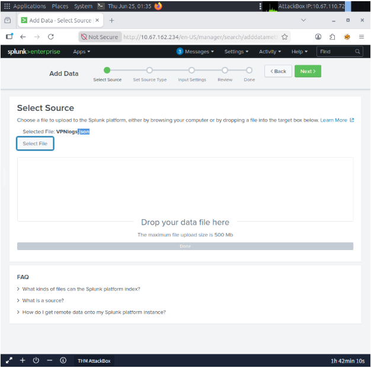
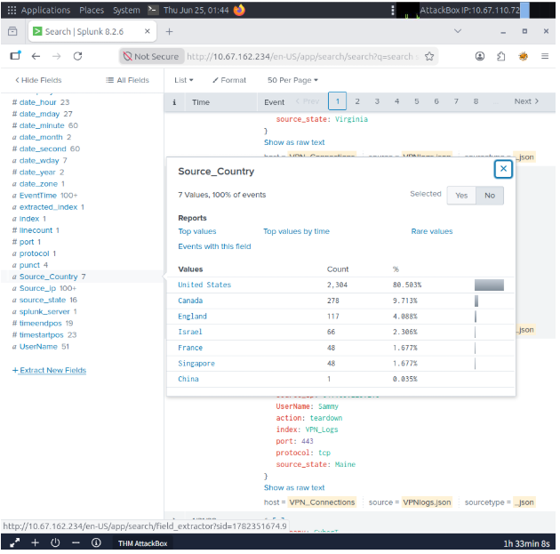
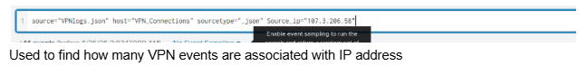

#Lab:

#Splunk has three main components: Forwarder, Indexer, and Search Head.
  #Forwwarder: A lightweight agent installed on the endpoint intended to be monitored, and its main task is to collect the data and send it to the Splunk instance.
  #Indexer: The main processor of data received from forwarders. Parses and normalizes data into field-value pairs, categorizes it, and stores the results as events, making the processed data easier to search and analyze.
  #Search Head: The place within the Search & Reporting App where users can search the indexed logs.
    #Searches are done using SPL (Search Processing Language)

#In VM, click on firefox, type in http://10.67.162.234 (IP address of VM)

#Download VPN data from /root/Rooms/SpunkBasic/ directory, and then click "Next"

#Upload file as .JSON

#Rename Host field value as "VPN_Connections"

#Once file is uploaded properly, utilize information tab to find top-level data:

#For data that requires searching, such as finding how many VPN events are associated with a specific IP address, or which username
#is associated with a specific IP address, utilize SPL in the searchbar with the following lines:

#Doing so helps to find specific data without needing to manually comb over thousands of records.
