#This lab from TryHackMe is all about stopping our company's penetration tester, Sphinx, from stealing our client's data. I needed to chase Sphinx up the Pyramid of Pain in order to get him to back down, and keep the client's information safe.

#I started off by scanning the first email attachment in a sandbox, assuming that it was a phishing link. The report confirmed that this was definitely a phishing attack, and would need to be addressed quickly.

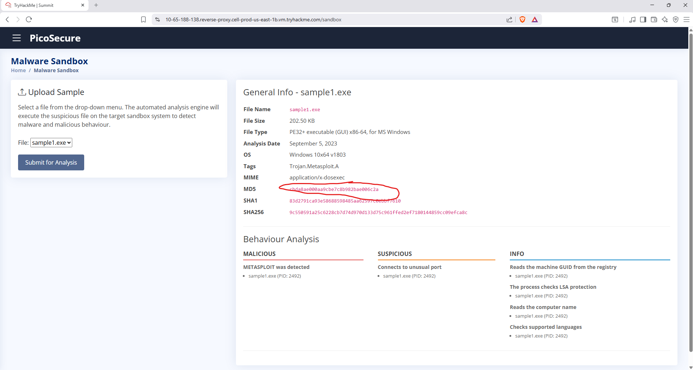

#This one was relatively easy to stop. I started by using the MD5 Hash value to add it to our block list. This blocked attack number 1, even though it's only a short term solution.

#The second attacck was a little more challenging. Sphinx could easily bypass my hash blocker by changing just one bit of the malware. As a result, the entire hash changes, and my blocker is useless.

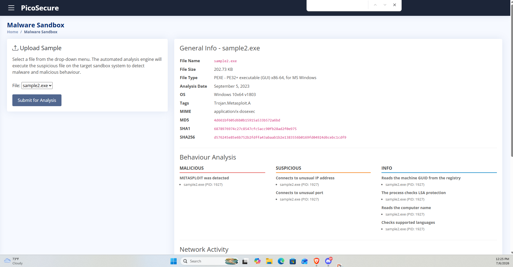
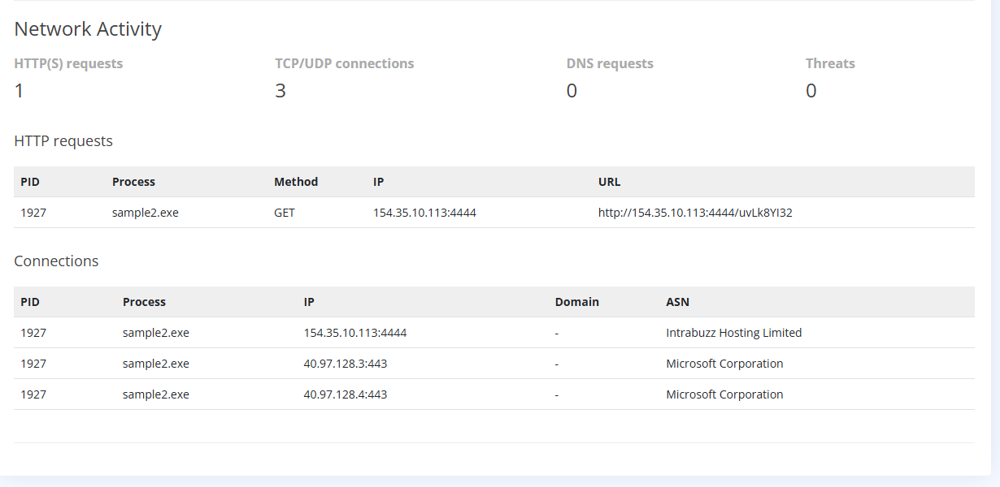

#I took the file that Sphinx sent me and put it through the Sandbox again. I noticed that he was using the same IP address consistently during the attack, so I blocked it using an Egress firewall rule. This denied all traffic to the IP, cancelling his attack for now.

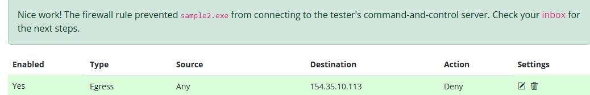

#Unfortunately, Sphinx proved to be a determined attacker. Since I blocked his original IP address, he went to a CSP to purchase a large amount of them, effectively bypassing my second layer of defense. Since I can't waste time blocking an infinite number of IPs one by one,
#I needed to move on to a second method.

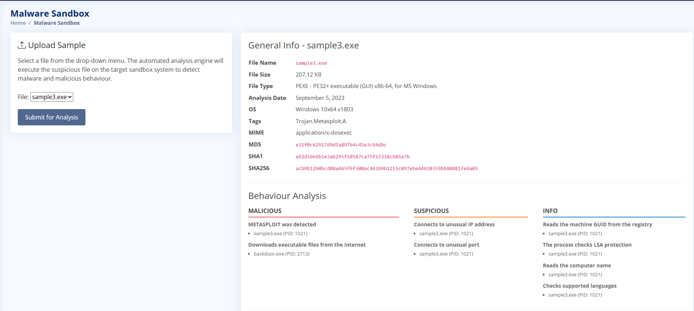
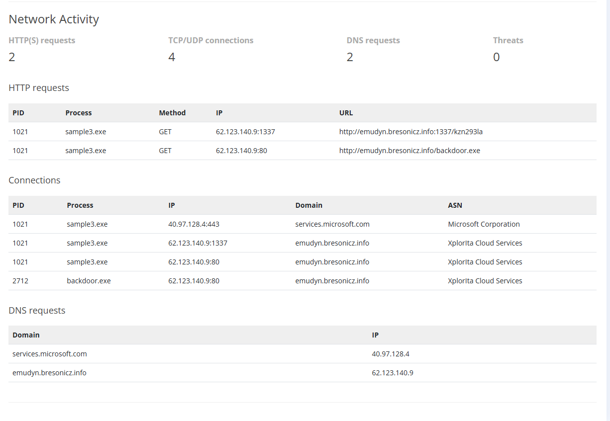

#I did notice a flaw with Sphinx's attack: all of his IPs were attached to the same Domain Name. As a result of this, I was able to change the rules for our DNS server, and blocked all of his IPs at once.

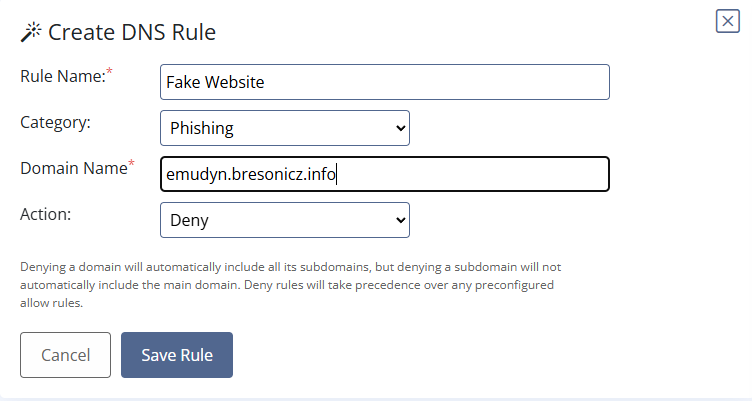

#At this stage, I've officially annoyed Sphinx, since he now needed to find an even more costly attack measure. Each step up on the Pyramid of Pain not only increases our defensive capabilities, but also harms Sphinx's efforts. He left a cryptic message about artifacts
#from his attacks, and left it at that.

#I then scanned his email to review the information that he left me.

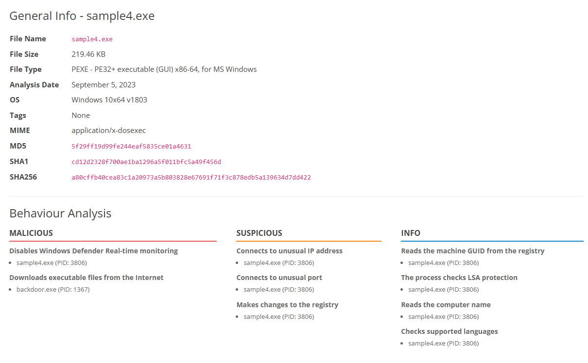
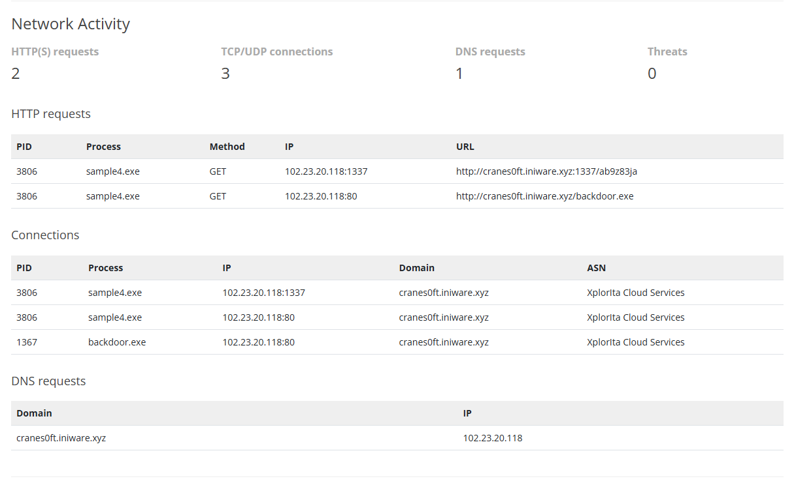
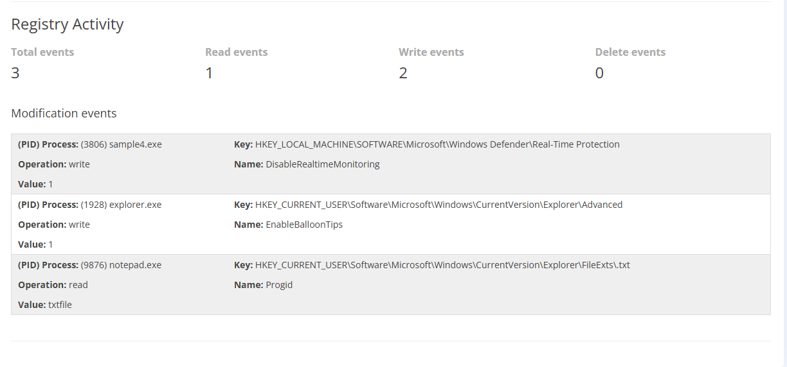

#After some exploring, I noticed that the attached registry key was being deployed to turn off Realtime Monitoring. This is in line with MITRE TA0005, Defense Evasion. By shutting down this registry modification, our defenses came back online and were able to catch
#Sphinx again.

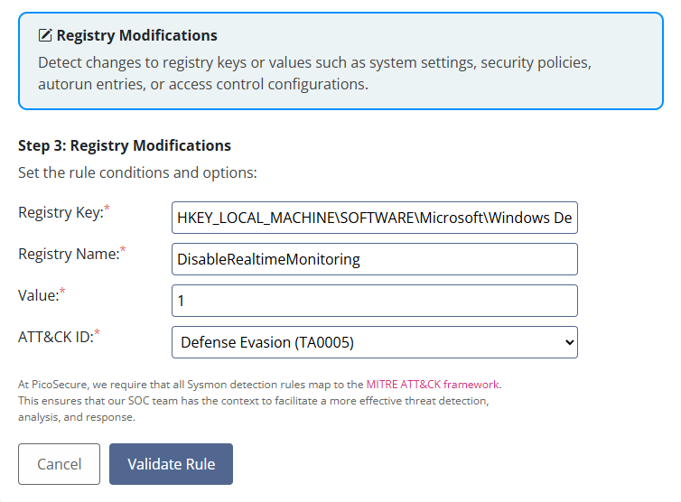

#Now Sphinx was getting frustrated. Most attackers would stop at this point and cut their losses, but the Red Team had been given a large budget to be able to continue their attack. I scanned the email that I was given in the sandbox and began the next hunt.

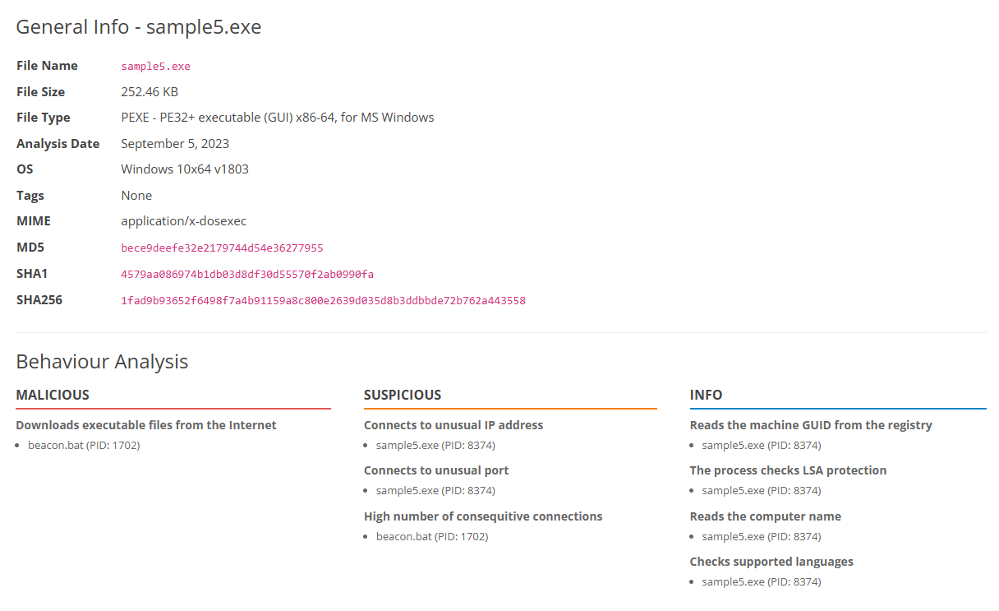
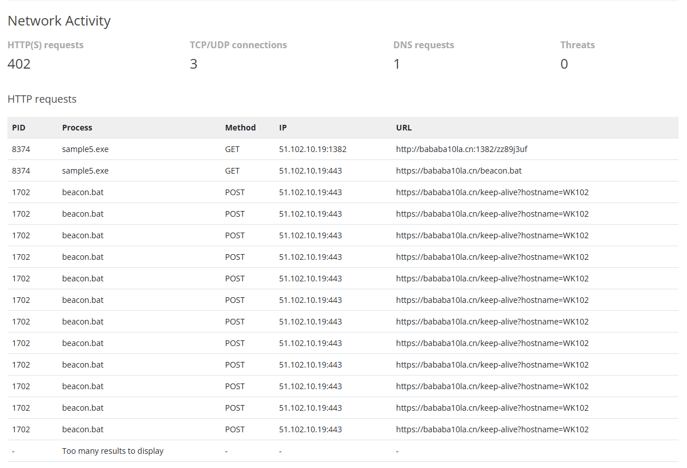
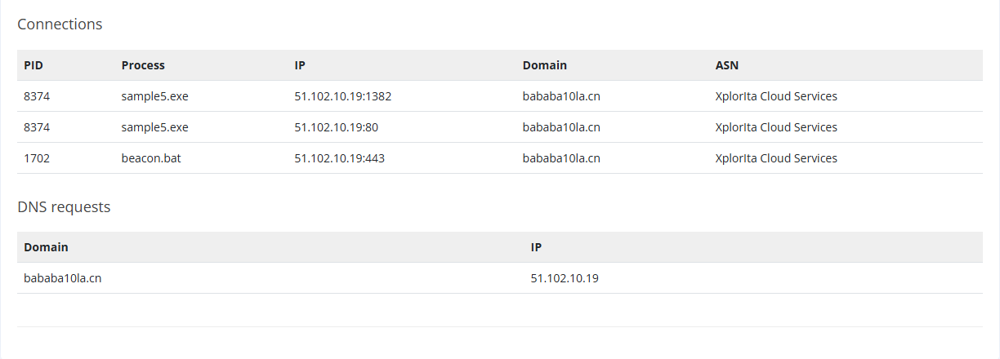

#After more exploring, I noticed that Sphinx was using a VPN network, so blocking his new IP wouldn't do anything to prevent his next attack. Instead, I disabled any remote IP and remote Port that was trying to remove 97B every 1800s, the pattern that established
#itself in the photos above. Doing so stopped Spphinxes attack (MITRE TA0011, Command and Control), and limited his resources significantly.

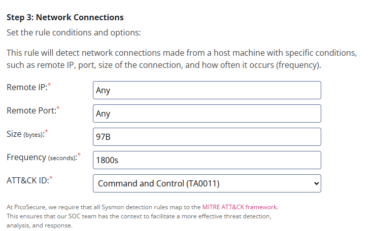

#In his final effort, Sphinx informed me that I was becoming a major nuisance. I scanned his email and attack file to see what to do next:

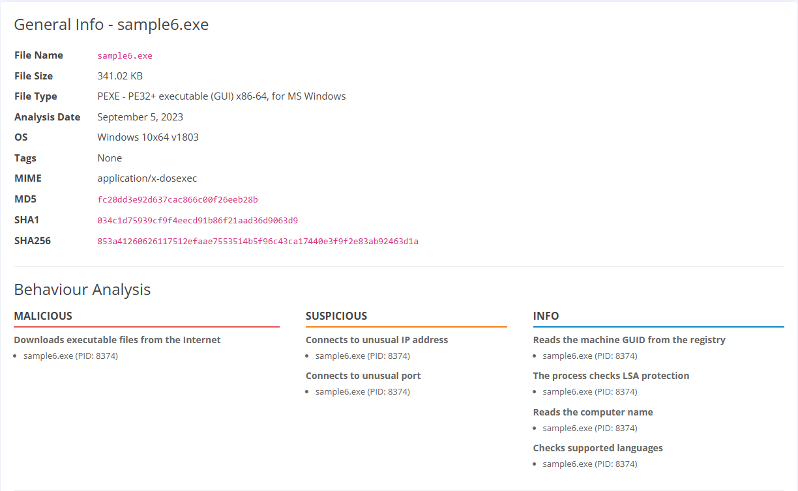
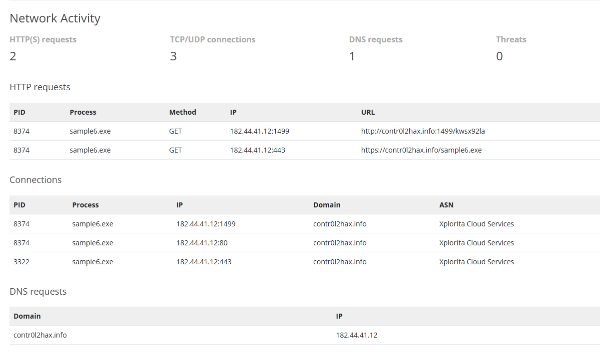

#Here I discovered that he was trying to create a file that would help to exfiltrate data. The file path %temp%, and log name exfiltr8.log, are displayed in the photo below. The lab closed too quickly for me to get the screenshot, but the MITRE step we were on was
#Discovery (TA0007).

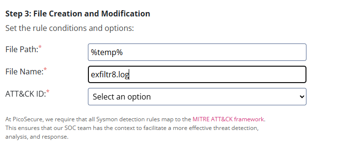

#From here, Sphinx gave up and quit attacking the system!
