#Wireshark is an open-source, cross-platform network packet analyzer tool capable of sniffing and investigating live traffic and inspecting packet captures (PCAP)
  #It is commonly used as one of the best packet analysis tools

#In this lab, I completed the following learning objectives:
  #Navigate and configure Wireshark
  #Inspect packets and discover information from the different layers of TCP/IP
  #Apply display filters

#To do so, I utilized two files: http1.pcapng, and Exercise.pcapng

#Lab

#First, I opened Wireshark
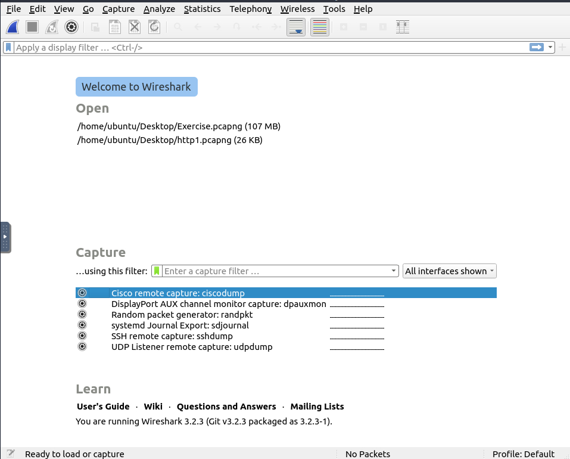

#Then I opened the http1.pcap file
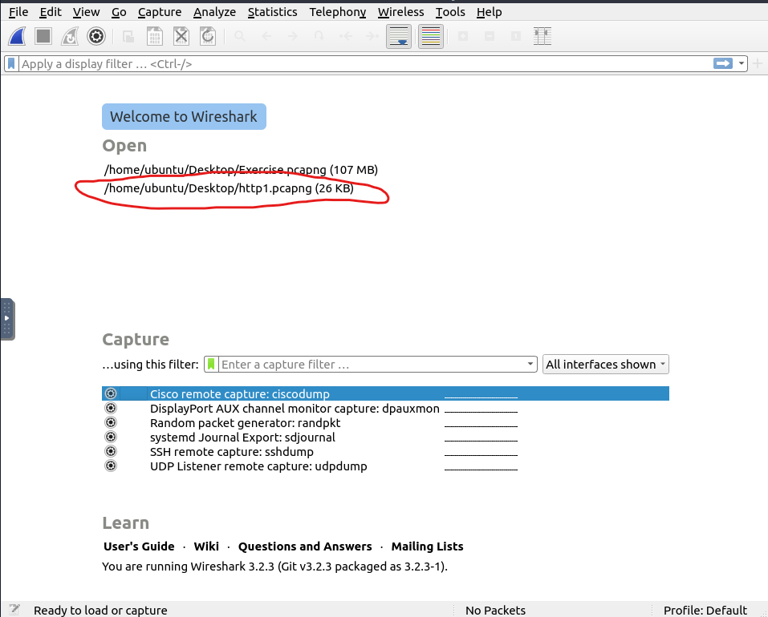

#The screen below showed the processed filename, detailed number of packets, and packet details. Packet details are shown in three different panes, which allowed me to discover them in different formats
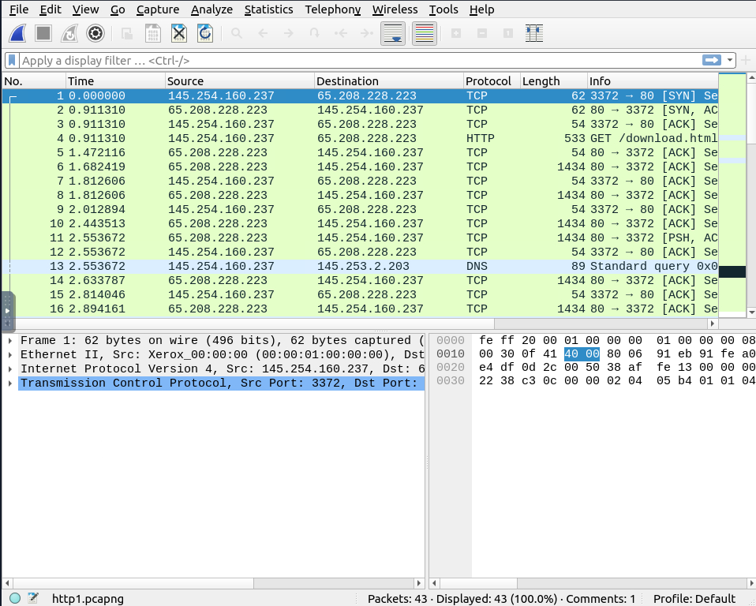

#Under "View", I selected "Coloring Rules", which allowed me to see the new menu showed below
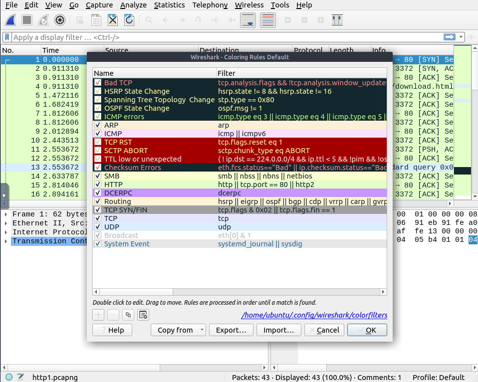

#The blue shark fin icon is used to start network sniffing (capturing traffic), and the red button will stop the sniffing. The green button will restart the sniffing process.
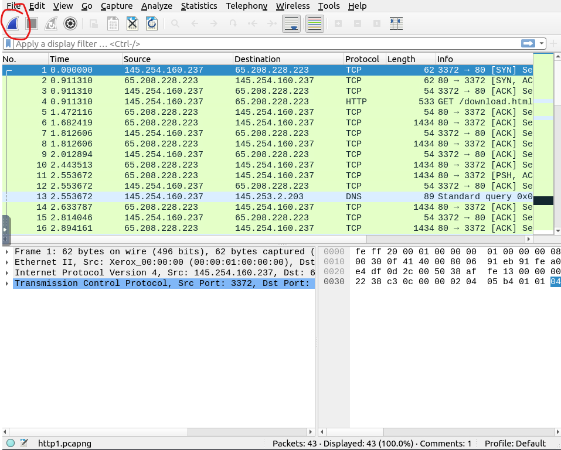

#Wireshark can combine two pcap files into a single file. YOu can use the "File --> Merge" menu path to merge a pcap with the processed one.

#Once merged, we can click on "Statistics --> Capture File Properties"

#This file will display the SHA256, Flag, and Number of packets captured
  #NOTE: During the lab, a second packet was apparently scanned in, resulting in the flag being correct, but the SHA256 and Number of packets to be wrong. In future settings, I think that it's important to ensure that the sniffer only takes the packets requested ONCE
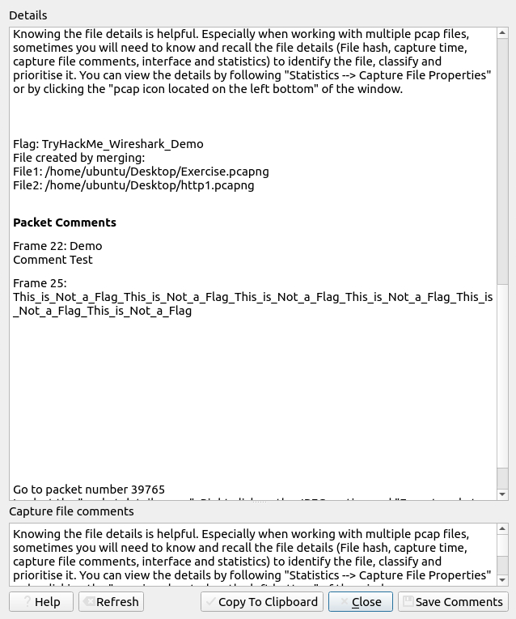

#Lab Pt. 2

#Packet dissection/protocol dissection - Investigates packet details by decoding available protocols and fields

#Packet details can be viewed by clicking on the number of the packet that you want to inspect on the top of the screen (green), and then by clicking on a line in the bottom left of the screen. The highlighted section on the right side corresponds to it
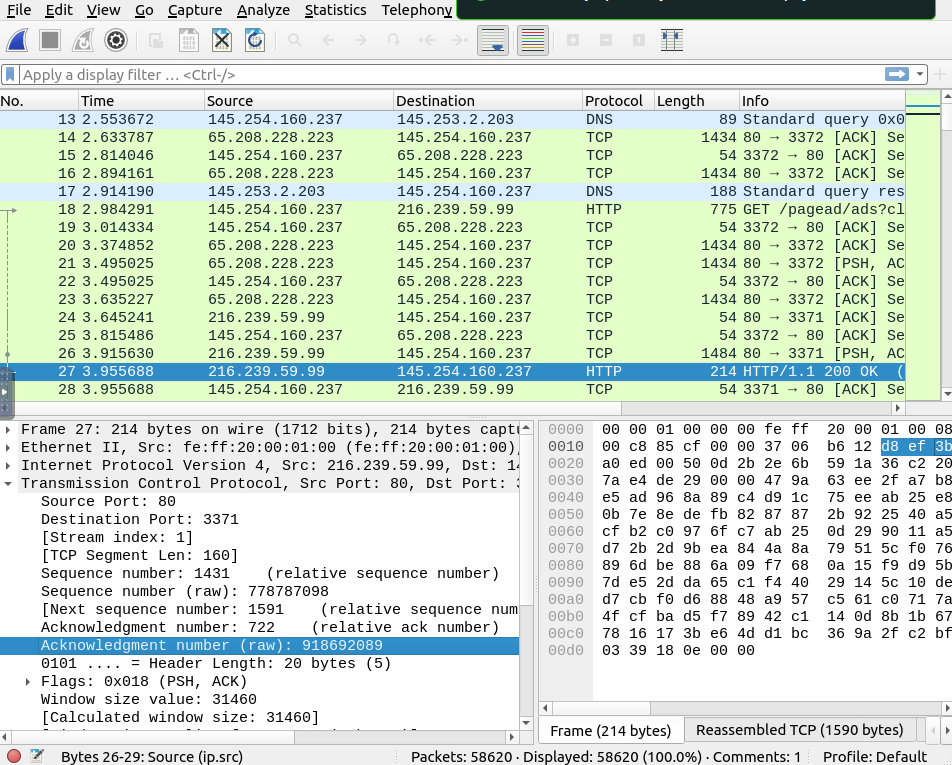

#The packet has seven distinct layers that can be viewed: frame/packet, source [MAC], source [IP], protocol, protocol errors, application protocol, and application data
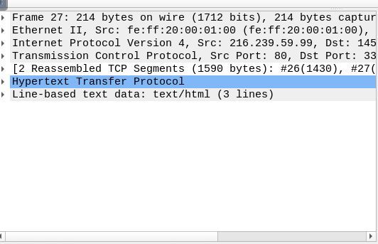

#Frame Layer - Shows you what frame/packet you are looking at and details specific to the Physical layer of the OSI model
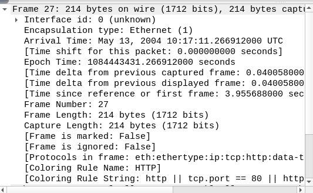                            

#Source [MAC] Layer - Shows you the source and destination MAC Addresses; from the Data Link layer of the OSI model
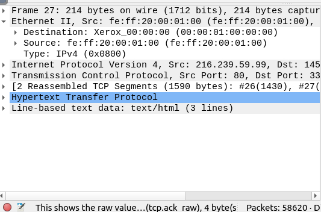

#Source [IP] Layer - Shows you the source and destination IPv4 Addresses, from the Network layer of the OSI model
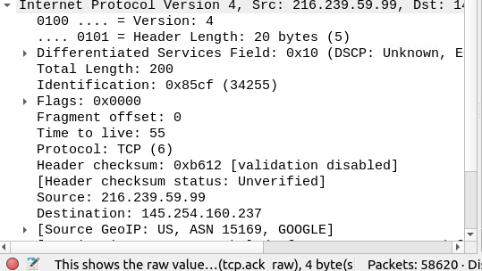

#Protocol Layer - Shows you details of the protocol used (UDP/TCP) and source and destination ports, from the Transport layer of the OSI model
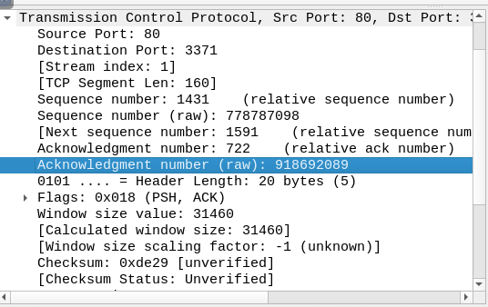

#Protocol Erros - The continuation of the 4th layer, shows specific segments from TCP that needed to be reassembled
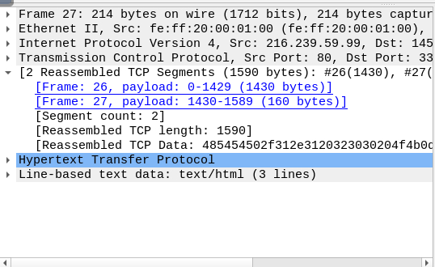

#Application Protocol Layer - Shows details specific to the protocol used, such as HTTP, FTP, and SMB. From the Application layer of the OSI model
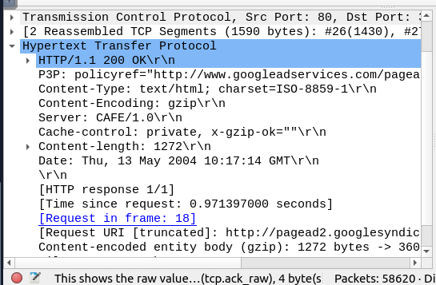

#Application Data - Extension of the 5th Layer can show the application-specific data
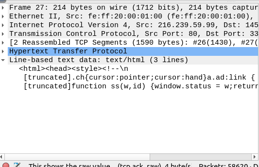

#Questions:

#Using packet 38, answer the following:
  #Which markup language is used under the HTTP protocol?
  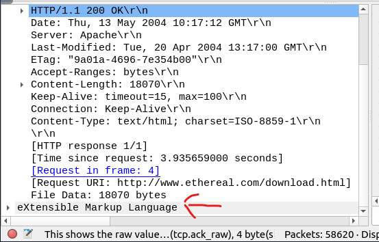
  #What is the arrival date of the packet?
  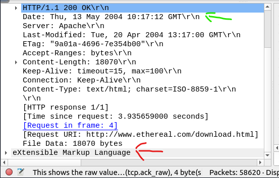
  #What is the TTL value?
  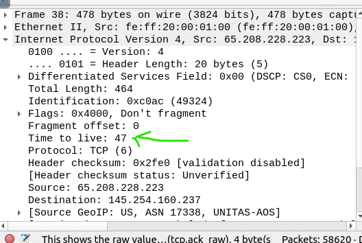
  #What is the TCP payload size?
  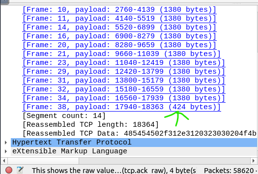
  #What is the e-tag value?
  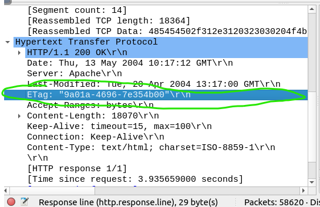
